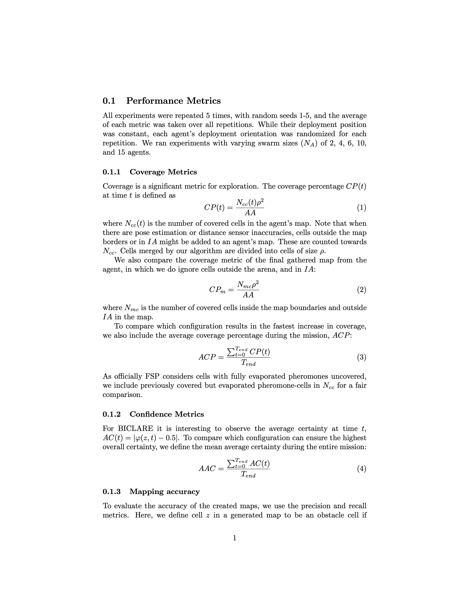
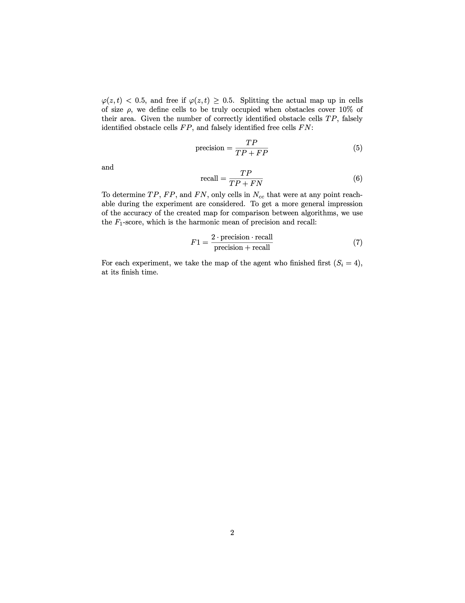

# BICLARE

This page presents additional companion material for the paper titled: "BICLARE: Bio-Inspired Collaborative Lightweight Algorithm for Robust Swarm Exploration".

---

## Six virtual environments

  
  
  

  
  
  

<b>Figure 5.</b> Six virtual maps used for performance evaluation of the BICLARE algorithm.

## Localization Error Heatmaps

### Magnitude heatmaps ($M_\text{mag}$)

<table>
  <tr>
    <th>House</th>
    <th>Office</th>
    <th>Museum</th>
  </tr>
  <tr>
    <td></td>
     <td></td>
    <td></td>
  </tr>
</table>

<b>Figure 6a.</b> Localization error magnitude heatmaps ($M_\text{mag}$) - for all maps: $μ = 0.226, min = 0.004, max = 1.033, σ = 0.152, median = 0.193$.

### Direction heatmaps ($M_\text{dir}$)

<table>
  <tr>
    <th>House</th>
    <th>Office</th>
    <th>Museum</th>
  </tr>
  <tr>
    <td></td>
    <td></td>
    <td></td>
  </tr>
</table>

<b>Figure 6b.</b> Localization error direction heatmaps ($M_\text{dir}$).

### Orientation Error Heatmaps ($M_θ$)

<table>
  <tr>
    <th>House</th>
    <th>Office</th>
    <th>Museum</th>
  </tr>
  <tr>
    <td>
        
    </td>
    <td>
        
    </td>
    <td>
        
    </td>
  </tr>
</table>

<b>Figure 7.</b> Orientation error heatmaps $M_0$ for different environments.

## Dynamic Obstacles and Agent Deployment

<table>
  <tr>
    <th>House</th>
    <th>Office</th>
    <th>Museum</th>
  </tr>
  <tr>
    <td>
        
    </td>
    <td>
        
    </td>
    <td>
        
    </td>
  </tr>
</table>

<b>Figure 8.</b> Dynamic obstacles with spawn order (red) and agent deployment positions (blue) in each map.

## Examples of generated maps from experiments with $f_e= 1.5$

<table>
<tbody>
<tr>
    <th>
        house_tilted 
        $N_A = 2$ 
        $T_\text{spawn} = 0$   
        $F_1 = 87.2\%$, 
        $CP_m = 78.9\%$
    </th>
    <th>
        office 
        $N_A = 6$ 
        $T_\text{spawn} = 180$ 
        $F_1 = 88.8\%$ 
        $CP_m = 91.9\%$
    </th>
    <th>
        museum_tilted 
        $N_A = 15$ 
        $T_\text{spawn} = 100$ 
        $F_1 = 89.6\%$ 
        $CP_m = 99.8\%$
    </th>
</tr>
<tr>
    <td>
        
    </td>
    <td>
        
    </td>
    <td>
        
    </td>
</tr>
</tbody>
</table>

<b>Figure 15.</b> Maps extracted from certain experiments with $f_e= 1.5$.

## Performance of different algorithms across all maps and swarm sizes

<table>
<tbody>
<tr>
    <th>
        house_tilted 
        $N_A=15$ 
        $f_e=0$
    </th>
    <th>
        office 
        $N_A=4$ 
        $f_e=0$
    </th>
    <th>
        museum_tilted 
        $N_A=6$ 
        $f_e=1$
    </th>
</tr>
<tr>
    <td>
        
    </td>
    <td>
        
    </td>
    <td>
        
    </td>
</tr>
</tbody>
</table>

<b>Figure 16.</b> Cell observation count distribution. Averaged over $T_\text{spawn}$.

## Localization error simulation results

  <table>
    <caption>
        <b>Table 1.</b> Specifications of localization error simulation.
    </caption>
    <thead>
      <tr>
        <th>Metric</th>
        <th>Value [m]</th>
      </tr>
    </thead>
    <tbody>
        <tr><td>Min</td><td>$0.004$</td></tr>
        <tr><td>Max</td><td>$1.033$</td></tr>
        <tr><td>Mean ($μ$)</td><td>$0.227$</td></tr>
        <tr><td>Median</td><td>$0.193$</td></tr>
        <tr><td>Std. dev. ($σ$)</td><td>$0.154$</td></tr>
    </tbody>
  </table>

## Variable parameter combinations for experiments

  <table>
    <caption>
      <b>Table 2. Variable parameter combinations for experiment 1.</b> 
    </caption>
    <thead>
      <tr>
        <th>Parameter</th>
        <th>Values</th>
      </tr>
    </thead>
    <tbody>
        <tr><td>$R_\text{comm}$</td><td>$[\infty]$</td></tr>
        <tr><td>$P_\text{loss}$</td><td>$[0]$</td></tr>
        <tr><td>$T_\phi$</td><td>$[100]$</td></tr>
        <tr><td>$T_\text{spawn}$</td><td>$[100,\ 180,\ \infty]$</td></tr>
        <tr><td>$f_e$</td><td>$[0,\ 0.5,\ 1,\ 1.5]$</td></tr>
        <tr><td>$R_f$</td><td>$[\infty]$</td></tr>
        <tr><td>$N_f$</td><td>$[\infty]$</td></tr>
        <tr><td>$N_s$</td><td>$[\infty]$</td></tr>
    </tbody>
  </table>

<table>
  <caption>
    <b>Table 3. Variable parameter combinations for experiment 2.</b> 
  </caption>
  <thead>
    <tr>
      <th>Parameter</th>
      <th>Value(s)</th>
    </tr>
  </thead>
  <tbody>
    <tr><td>$R_\text{comm}$</td><td>$[\infty]$</td></tr>
    <tr><td>$P_\text{loss}$</td><td>$[0]$</td></tr>
    <tr><td>$T_\phi$</td><td>$[100]$</td></tr>
    <tr><td>$T_\text{spawn}$</td><td>$[100,\ 180,\ \infty]$</td></tr>
    <tr><td>$f_e$</td><td>$[0,\ 1]$</td></tr>
    <tr><td>$R_f$</td><td>$[5,\ 15,\ \infty]$</td></tr>
    <tr><td>$N_f$</td><td>$[20,\ \infty]$</td></tr>
    <tr><td>$N_s$</td><td>$[30,\ \infty]$</td></tr>
  </tbody>
</table>

<table>
  <caption>
    <b>Table 4. Variable parameter combinations for experiment 3.</b> 
  </caption>
  <thead>
    <tr>
      <th>Parameter</th>
      <th>Values</th>
    </tr>
  </thead>
  <tbody>
    <tr><td>$R_\text{comm}$</td><td>$[\infty]$</td></tr>
    <tr><td>$P_\text{loss}$</td><td>$[0]$</td></tr>
    <tr><td>$T_\phi$</td><td>$[50,\ 100,\ 150,\ \infty]$</td></tr>
    <tr><td>$T_\text{spawn}$</td><td>$[100,\ 180,\ \infty]$</td></tr>
    <tr><td>$f_e$</td><td>$[0,\ 1]$</td></tr>
    <tr><td>$R_f$</td><td>$[\infty]$</td></tr>
    <tr><td>$N_f$</td><td>$[\infty]$</td></tr>
    <tr><td>$N_s$</td><td>$[\infty]$</td></tr>
  </tbody>
</table>

<table>
  <caption>
    <b>Table 5. Variable parameter combinations for experiment 4.</b> 
  </caption>
  <thead>
    <tr>
      <th>Parameter</th>
      <th>Values</th>
    </tr>
  </thead>
  <tbody>
    <tr><td>$R_\text{comm}$</td><td>$[5,\ 10,\ 15,\ \infty]$</td></tr>
    <tr><td>$P_\text{loss}$</td><td>$[0,\ 0.25,\ 0.5]$</td></tr>
    <tr><td>$T_\phi$</td><td>$[100]$</td></tr>
    <tr><td>$T_\text{spawn}$</td><td>$[100,\ 180,\ \infty]$</td></tr>
    <tr><td>$f_e$</td><td>$[0,\ 1]$</td></tr>
    <tr><td>$R_f$</td><td>$[\infty]$</td></tr>
    <tr><td>$N_f$</td><td>$[\infty]$</td></tr>
    <tr><td>$N_s$</td><td>$[\infty]$</td></tr>
  </tbody>
</table>

---

## Communication impact on performance metrics

### Effect of $R_\text{comm}$ and $P_\text{loss}$ on $F_1$, $CP_m$, and $ACP$ scores for different swarm sizes

    The table below summarizes the effect of communication range ($R_\text{comm}) and packet loss probability ($P_\text{loss}) on three performance metrics: $F_1$ score, final coverage percentage ($CP_m$), and average coverage percentage ($ACP$). Results are reported for different swarm sizes and averaged across all map configurations. All experiments were conducted with $f_e = 0$ and $T_\text{spawn} = 100$ to isolate the influence of communication constraints on swarm exploration and mapping performance.

### Performance of different algorithms

<b>Table 6.</b> Performance of different algorithms across all maps and swarm sizes, for $f_e = 0$.

<table>
  <tr>
    <th>Map</th>
    <th>NA</th>
    <th>ACP BICLARE-PP</th>
    <th>ACP BICLARE-WF</th>
    <th>ACP FSP-QT</th>
    <th>ACP FSP-G</th>
    <th>ACP FSP</th>
    <th>AAC BICLARE-PP</th>
    <th>AAC BICLARE-WF</th>
    <th>AAC FSP-QT</th>
  </tr>

  <!-- house -->
  <tr><td><i>house</i></td><td>2</td><td class="bold">69.40</td><td>66.68</td><td>49.12</td><td>61.19</td><td>61.68</td><td class="bold">0.2023</td><td>0.2001</td><td>0.1543</td></tr>
  <tr><td><i>house</i></td><td>4</td><td class="bold">82.74</td><td>78.30</td><td>68.23</td><td>70.00</td><td>69.33</td><td class="bold">0.2450</td><td>0.2259</td><td>0.1849</td></tr>
  <tr><td><i>house</i></td><td>6</td><td class="bold">84.78</td><td>84.41</td><td>75.09</td><td>75.77</td><td>77.05</td><td class="bold">0.2733</td><td>0.2420</td><td>0.1977</td></tr>
  <tr><td><i>house</i></td><td>10</td><td>84.65</td><td>85.67</td><td>80.47</td><td>84.49</td><td class="bold">86.71</td><td class="bold">0.3053</td><td>0.2769</td><td>0.2551</td></tr>
  <tr><td><i>house</i></td><td>15</td><td class="bold">88.73</td><td>87.77</td><td>84.56</td><td>85.44</td><td>87.47</td><td class="bold">0.3203</td><td>0.2896</td><td>0.2812</td></tr>

  <!-- house_tilted -->
  <tr><td><i>house_tilted</i></td><td>2</td><td>61.01</td><td class="bold">69.86</td><td>43.69</td><td>56.87</td><td>63.91</td><td class="bold">0.2145</td><td>0.2002</td><td>0.1979</td></tr>
  <tr><td><i>house_tilted</i></td><td>4</td><td>75.80</td><td class="bold">79.37</td><td>56.19</td><td>71.58</td><td>72.29</td><td class="bold">0.2470</td><td>0.2342</td><td>0.2191</td></tr>
  <tr><td><i>house_tilted</i></td><td>6</td><td>80.11</td><td>81.25</td><td>63.43</td><td>64.11</td><td class="bold">75.41</td><td class="bold">0.2730</td><td>0.2550</td><td>0.2423</td></tr>
  <tr><td><i>house_tilted</i></td><td>10</td><td class="bold">84.86</td><td>84.34</td><td>70.35</td><td>77.09</td><td>81.13</td><td class="bold">0.3071</td><td>0.2772</td><td>0.2676</td></tr>
  <tr><td><i>house_tilted</i></td><td>15</td><td class="bold">87.27</td><td>86.99</td><td>74.63</td><td>83.83</td><td>87.48</td><td class="bold">0.3195</td><td>0.2850</td><td>0.2867</td></tr>

  <!-- office -->
  <tr><td><i>office</i></td><td>2</td><td>53.92</td><td class="bold">57.30</td><td>44.51</td><td>46.25</td><td>50.83</td><td class="bold">0.1660</td><td>0.1337</td><td>0.0915</td></tr>
  <tr><td><i>office</i></td><td>4</td><td>67.42</td><td class="bold">71.77</td><td>46.31</td><td>59.04</td><td>57.78</td><td class="bold">0.2006</td><td>0.1747</td><td>0.1007</td></tr>
  <tr><td><i>office</i></td><td>6</td><td>73.09</td><td class="bold">79.32</td><td>61.54</td><td>64.25</td><td>77.50</td><td class="bold">0.2192</td><td>0.1815</td><td>0.1443</td></tr>
  <tr><td><i>office</i></td><td>10</td><td>83.45</td><td>83.38</td><td>65.01</td><td>79.74</td><td class="bold">82.05</td><td class="bold">0.2402</td><td>0.2033</td><td>0.1839</td></tr>
  <tr><td><i>office</i></td><td>15</td><td>85.48</td><td class="bold">88.94</td><td>69.31</td><td>83.88</td><td>85.70</td><td class="bold">0.2688</td><td>0.2201</td><td>0.2244</td></tr>

  <!-- office_tilted -->
  <tr><td><i>office_tilted</i></td><td>2</td><td>45.07</td><td class="bold">58.64</td><td>44.41</td><td>46.86</td><td>32.53</td><td class="bold">0.1808</td><td>0.1473</td><td>0.0971</td></tr>
  <tr><td><i>office_tilted</i></td><td>4</td><td>49.75</td><td>56.43</td><td>50.11</td><td>51.34</td><td class="bold">57.84</td><td class="bold">0.2163</td><td>0.1732</td><td>0.1594</td></tr>
  <tr><td><i>office_tilted</i></td><td>6</td><td>63.49</td><td class="bold">71.34</td><td>53.18</td><td>66.97</td><td>61.59</td><td class="bold">0.2257</td><td>0.1859</td><td>0.1676</td></tr>
  <tr><td><i>office_tilted</i></td><td>10</td><td>71.84</td><td class="bold">80.88</td><td>56.03</td><td>72.96</td><td>72.22</td><td class="bold">0.2543</td><td>0.2236</td><td>0.2015</td></tr>
  <tr><td><i>office_tilted</i></td><td>15</td><td>83.63</td><td class="bold">86.32</td><td>63.14</td><td>80.34</td><td>80.57</td><td class="bold">0.2653</td><td>0.2257</td><td>0.2126</td></tr>

  <!-- museum -->
  <tr><td><i>museum</i></td><td>2</td><td>23.52</td><td>32.05</td><td>10.63</td><td class="bold">37.70</td><td>28.38</td><td class="bold">0.1161</td><td>0.0988</td><td>0.1055</td></tr>
  <tr><td><i>museum</i></td><td>4</td><td>37.90</td><td>49.41</td><td>21.80</td><td>41.98</td><td class="bold">54.26</td><td class="bold">0.1246</td><td>0.1006</td><td>0.0956</td></tr>
  <tr><td><i>museum</i></td><td>6</td><td>50.59</td><td class="bold">66.90</td><td>21.59</td><td>60.86</td><td>59.26</td><td class="bold">0.1435</td><td>0.1191</td><td>0.1068</td></tr>
  <tr><td><i>museum</i></td><td>10</td><td>65.76</td><td>65.63</td><td>24.85</td><td>61.48</td><td class="bold">70.62</td><td class="bold">0.1612</td><td>0.1387</td><td>0.1180</td></tr>
  <tr><td><i>museum</i></td><td>15</td><td>71.99</td><td class="bold">75.52</td><td>39.41</td><td>77.58</td><td>75.12</td><td class="bold">0.1841</td><td>0.1497</td><td>0.1245</td></tr>

  <!-- museum_tilted -->
  <tr><td><i>museum_tilted</i></td><td>2</td><td>24.47</td><td>30.81</td><td>12.39</td><td>29.69</td><td class="bold">31.63</td><td class="bold">0.1297</td><td>0.1118</td><td>0.1096</td></tr>
  <tr><td><i>museum_tilted</i></td><td>4</td><td>37.47</td><td>41.72</td><td>16.49</td><td>45.82</td><td class="bold">51.68</td><td class="bold">0.1451</td><td>0.1229</td><td>0.1257</td></tr>
  <tr><td><i>museum_tilted</i></td><td>6</td><td>46.49</td><td class="bold">63.00</td><td>28.44</td><td>47.66</td><td>57.10</td><td class="bold">0.1538</td><td>0.1361</td><td>0.1114</td></tr>
  <tr><td><i>museum_tilted</i></td><td>10</td><td>57.32</td><td class="bold">65.91</td><td>30.01</td><td>66.06</td><td>68.27</td><td class="bold">0.1748</td><td>0.1434</td><td>0.1142</td></tr>
  <tr><td><i>museum_tilted</i></td><td>15</td><td>69.12</td><td class="bold">74.24</td><td>40.99</td><td>65.72</td><td>80.32</td><td class="bold">0.1948</td><td>0.1579</td><td>0.1360</td></tr>
</table>

---

## Comparison of the effect of $R_f$ on $CP_m$ and $F_1$ score metrics across different environments

    The table below presents a comparative analysis of how the parameter $R_f$ influences two key performance metrics — the final coverage percentage ($CP_m$) and the $F_1$ score — across different environmental scenarios. All experiments were conducted with $f_e = 0$ and $T_\text{spawn} = 0$ to isolate the effect of $R_f$ from other dynamic factors. The reported results reflect the mean values of each metric over repeated trials, with standard deviations ranging from $0.04$ to $1.19$ for $CP_m$ and from $0.09$ to $0.33$ for the $F_1$ score. These results provide insight into the sensitivity of the exploration and mapping performance to variations in $R_f$ under controlled conditions.

<b>Table 7.</b> Comparison of the effect of $R_f$ on $CP_m$ and $F_1$ score metrics across different environments. $f_e = 0$ and $T_\text{spawn} = 0$. Standard deviations are between $0.04$ and $1.19$ for $CP_m$ and $0.09$ and $0.33$ for $F_1$ score.

  <table>
    <thead>
      <tr>
        <th>NA</th>
        <th>Rf</th>
        <th>Map</th>
        <th>CPm B-PP</th>
        <th>CPm B-WF</th>
        <th>CPm FSP-QT</th>
        <th>CPm FSP-G</th>
        <th>CPm FSP</th>
        <th>F1 B-PP</th>
        <th>F1 B-WF</th>
        <th>F1 FSP-QT</th>
        <th>F1 FSP-G</th>
        <th>F1 FSP</th>
      </tr>
    </thead>
    <tbody>
      <tr><td>2</td><td>5</td><td><i>house_tilted</i></td><td>88.37</td><td>92.24</td><td>59.55</td><td>73.12</td><td>84.66</td><td>97.55</td><td>97.57</td><td>96.54</td><td>95.69</td><td>95.57</td></tr>
      <tr><td>2</td><td>5</td><td><i>office_tilted</i></td><td>65.95</td><td>84.82</td><td>44.70</td><td>63.11</td><td>42.49</td><td>98.25</td><td>97.55</td><td>97.89</td><td>97.70</td><td>97.50</td></tr>
      <tr><td>2</td><td>5</td><td><i>museum_tilted</i></td><td>32.31</td><td>52.07</td><td>13.79</td><td>41.87</td><td>44.05</td><td>97.95</td><td>97.11</td><td>97.62</td><td>97.90</td><td>98.10</td></tr>
      <tr><td>2</td><td>15</td><td><i>house_tilted</i></td><td>83.42</td><td>87.92</td><td>52.88</td><td>77.41</td><td>84.52</td><td>97.49</td><td>97.26</td><td>97.05</td><td>95.65</td><td>95.59</td></tr>
      <tr><td>2</td><td>15</td><td><i>office_tilted</i></td><td>65.22</td><td>86.01</td><td>49.79</td><td>59.01</td><td>41.32</td><td>98.25</td><td>97.79</td><td>97.47</td><td>97.58</td><td>97.62</td></tr>
      <tr><td>2</td><td>15</td><td><i>museum_tilted</i></td><td>41.58</td><td>52.23</td><td>13.50</td><td>40.68</td><td>38.65</td><td>98.33</td><td>97.25</td><td>97.88</td><td>98.02</td><td>98.11</td></tr>
      <tr><td>6</td><td>5</td><td><i>house_tilted</i></td><td>98.32</td><td>94.59</td><td>78.87</td><td>76.84</td><td>98.75</td><td>98.22</td><td>97.96</td><td>97.30</td><td>95.29</td><td>95.44</td></tr>
      <tr><td>6</td><td>5</td><td><i>office_tilted</i></td><td>90.86</td><td>97.79</td><td>64.18</td><td>79.30</td><td>78.94</td><td>98.47</td><td>98.27</td><td>98.01</td><td>97.33</td><td>97.36</td></tr>
      <tr><td>6</td><td>5</td><td><i>museum_tilted</i></td><td>67.37</td><td>67.87</td><td>33.87</td><td>58.15</td><td>80.16</td><td>98.50</td><td>97.68</td><td>97.42</td><td>97.88</td><td>97.59</td></tr>
      <tr><td>6</td><td>15</td><td><i>house_tilted</i></td><td>98.78</td><td>98.65</td><td>78.20</td><td>77.96</td><td>98.56</td><td>98.26</td><td>97.97</td><td>97.16</td><td>95.44</td><td>95.39</td></tr>
      <tr><td>6</td><td>15</td><td><i>office_tilted</i></td><td>89.55</td><td>96.67</td><td>61.77</td><td>87.72</td><td>82.69</td><td>98.34</td><td>98.33</td><td>98.08</td><td>97.28</td><td>97.20</td></tr>
      <tr><td>6</td><td>15</td><td><i>museum_tilted</i></td><td>70.58</td><td>91.14</td><td>30.41</td><td>65.81</td><td>86.70</td><td>98.37</td><td>97.74</td><td>97.80</td><td>97.67</td><td>97.45</td></tr>
      <tr><td>15</td><td>5</td><td><i>house_tilted</i></td><td>99.14</td><td>98.90</td><td>93.05</td><td>99.32</td><td>98.49</td><td>98.52</td><td>97.92</td><td>97.53</td><td>95.29</td><td>95.58</td></tr>
      <tr><td>15</td><td>5</td><td><i>office_tilted</i></td><td>96.84</td><td>97.82</td><td>81.27</td><td>97.64</td><td>97.73</td><td>98.48</td><td>98.53</td><td>98.36</td><td>97.03</td><td>97.02</td></tr>
      <tr><td>15</td><td>5</td><td><i>museum_tilted</i></td><td>93.96</td><td>95.76</td><td>65.52</td><td>91.61</td><td>99.17</td><td>98.63</td><td>98.03</td><td>98.11</td><td>97.33</td><td>97.24</td></tr>
      <tr><td>15</td><td>15</td><td><i>house_tilted</i></td><td>99.14</td><td>98.88</td><td>89.75</td><td>98.81</td><td>98.32</td><td>98.56</td><td>97.74</td><td>97.46</td><td>95.52</td><td>95.60</td></tr>
      <tr><td>15</td><td>15</td><td><i>office_tilted</i></td><td>98.04</td><td>97.87</td><td>78.35</td><td>97.79</td><td>98.32</td><td>98.52</td><td>98.43</td><td>98.05</td><td>96.99</td><td>97.01</td></tr>
      <tr><td>15</td><td>15</td><td><i>museum_tilted</i></td><td>92.90</td><td>96.92</td><td>50.17</td><td>92.80</td><td>99.72</td><td>98.68</td><td>98.18</td><td>97.48</td><td>97.33</td><td>97.22</td></tr>
    </tbody>
  </table>

---

## Position Estimation Model

    To accurately simulate the localization process of each agent, we incorporate both magnitude and directional components of position estimation errors into the model. Using the position estimation magnitude and direction heatmaps, denoted as $M_{mag}$ and $M_{dir}$ respectively, the estimated position $\mathbf{p}_i$ of each agent $A_i$ is computed as a function of its true position and a generated offset vector. This offset captures systematic and stochastic components of localization uncertainty, including error magnitude, direction deviation, and random noise.

    The following equations describe the full formulation of the estimated position model, where the offset vector $v_{i,offset}$ is determined based on the heatmap data, scaling factor $f_e$, and random noise terms. These terms are drawn from Gaussian distributions with standard deviations $\sigma_p = 0.05f_e$ for positional error and $\sigma_\theta = 0.0698f_e$ radians for angular error. Together, they allow the simulation to realistically approximate sensor inaccuracies and environmental effects on localization.

    

---

## Performance Metrics Overview

    To comprehensively evaluate the performance of the proposed system, we conducted a series of controlled experiments aimed at measuring exploration efficiency, decision confidence, and mapping accuracy under various swarm configurations. Each experiment was repeated five times with different random seeds (1–5), and the average value of each metric was calculated across all repetitions to ensure statistical robustness. While the deployment position of the agents remained constant throughout all trials, their initial orientations were randomized for each run to introduce variability. Experiments were performed for swarms of different sizes ($N_A = 2, 4, 6, 10, 15$) in order to study the scalability and collective behavior of the system.

    The following subsections present and discuss the primary performance indicators used in our analysis. These include coverage metrics, which quantify the efficiency and extent of environment exploration; confidence metrics, which measure the certainty of decision-making across the mission timeline; and mapping accuracy metrics, which assess how faithfully the reconstructed environment reflects the ground truth. Together, these measures provide a comprehensive view of the system’s capabilities, limitations, and potential for deployment in real-world multi-agent scenarios.

    
    

