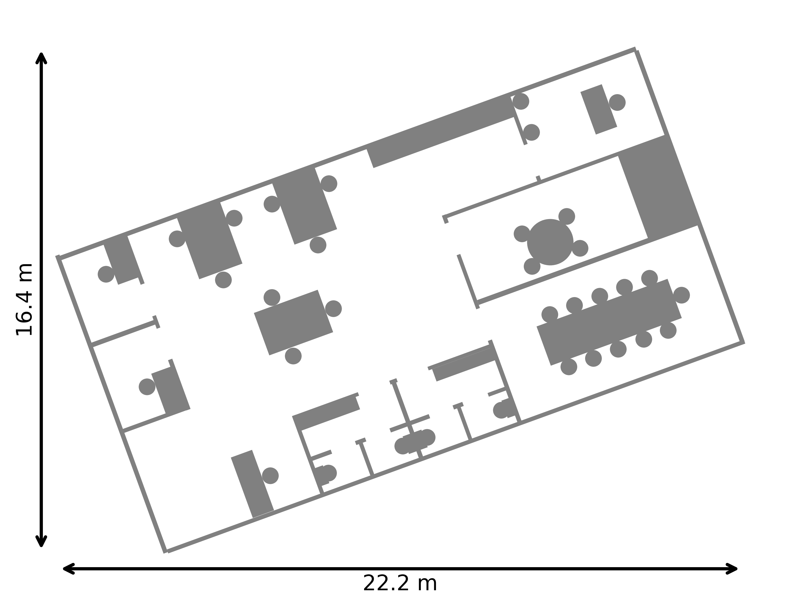

# BICLARE

This page presents additional companion material for ...

---

## Six Virtual Environments  FIG. 5 

  
  
  

  
  
  

<em>Figure 5: Six virtual maps used for performance evaluation of the BICLARE algorithm.</em>

## Six Virtual Environments  FIG. 6
<h2>Localization Error Heatmaps</h2>

<h3>Magnitude heatmaps (<i>Mmag</i>)</h3>

<table style="width:100%; text-align:center;">
  <tr>
    <th>House</th>
    <th>Office</th>
    <th>Museum</th>
  </tr>
  <tr>
    <td></td>
     <td></td>
    <td></td>
  </tr>
</table>

<b>Figure 1.</b> Localization error magnitude heatmaps <i>Mmag</i>. 
For all maps: μ = 0.226, min = 0.004, max = 1.033, σ = 0.152, median = 0.193.

<h3>Direction heatmaps (<i>Mdir</i>)</h3>

<table style="width:100%; text-align:center;">
  <tr>
    <th>House</th>
    <th>Office</th>
    <th>Museum</th>
  </tr>
  <tr>
    <td></td>
    <td></td>
    <td></td>
  </tr>
</table>

<b>Figure 2.</b> Localization error direction heatmaps <i>Mdir</i>.

<h3>Orientation Error Heatmaps <i>Mθ</i></h3>

  

    
    
<b>House</b>

  

  

    
    
<b>Office</b>

  

  

    
    
<b>Museum</b>

  

<b>Figure:</b> Orientation error heatmaps <i>Mθ</i> for different environments.

<h3>Dynamic Obstacles and Agent Deployment</h3>

  

    
    
<b>House</b>

  

  

    
    
<b>Office</b>

  

  

    
    
<b>Museum</b>

  

<b>Figure:</b> Dynamic obstacles with spawn order (red) and agent deployment positions (blue) in each map.

<h3>Examples of Generated Maps (for <i>fe = 1.5</i>)</h3>

  

    
    
<b>House_tilted</b> 
    <i>NA=2</i>, <i>Tspawn=0</i> 
    F1=87.2%, CPm=78.9%

  

  

    
    
<b>Office</b> 
    <i>NA=6</i>, <i>Tspawn=180</i> 
    F1=88.8%, CPm=91.9%

  

  

    
    
<b>Museum_tilted</b> 
    <i>NA=15</i>, <i>Tspawn=100</i> 
    F1=89.6%, CPm=99.8%

  

<b>Figure:</b> Examples of generated maps from experiments with <i>fe = 1.5</i>.

